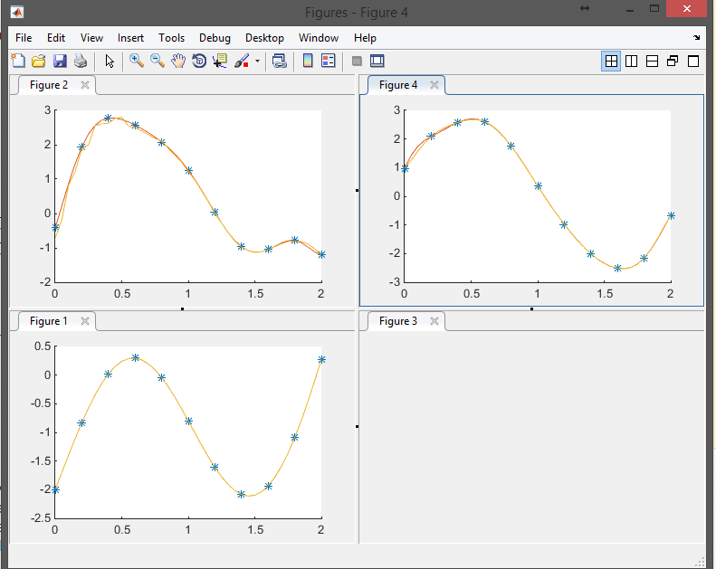

# MIMO-Gaussian-Process-Identification-Matlab
Beta version of Multi output Gaussian Process indetification

<center> </center>

with covariance
```octave
                 /       D/2                                                                          \
            M   │    (2*pi)  *V(m,i)*V(m,j)       /    1                                            \  │
 C(1,1)= SUM    │  ----------------------   exp │  - --- (ds-[u(m,i)-u(m,j))'*E*(ds-[u(m,i)-u(m,j)) │  │
           m=1  │                      ½         \    2                                             /  │
                │    (│A(m,j)+A(m,i)│)                                                                 │
                 \                                                                                    /
```
For 2x2 mimo system the algorithm is working . However for 3x3 inputs there is problem in optimization with optimization of matlab
I am working to implement a more reliable optimization

<center> </center>
